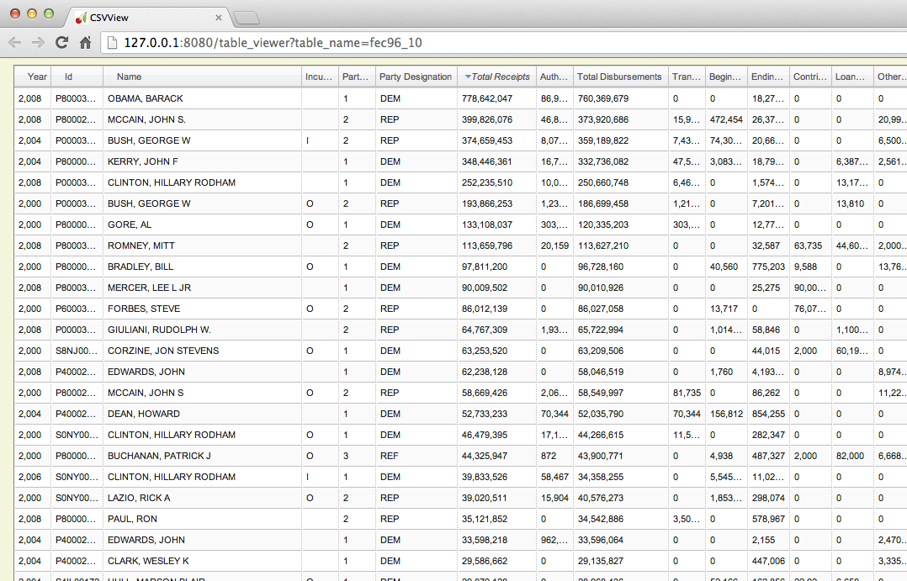

# csvview

## Overview

csvview is a minimal CSV file viewer with a web-based UI launched from the command line.

csvview is built using 
[SlickGrid](http://github.com/mleibman/slickgrid), an advanced JavaScript grid/spreadsheet component.  csvview uses the adaptive virtual scrolling feature of SlickGrid to load only as much data into the browser as needed to maintain the current view shown in the browser pane.  This should allow csvview to be used to browse through potentially huge CSV files.

csvview currently supports sorting by a single column.  Click on a column header to sort by that column.

## Usage

Example:

    $ ./csvview csv/fec96_10.csv

will open a new tab in the default web browser that looks something like this:

Note that csvview runs a local web server internally to serve the initial web page and provide data on demand during scrolling.  You must keep csvview running to be able to scroll through the CSV file.

## Installation

csvview is written in a combination of Python (2.7.2) and JavaScript.

csvview includes a copy of SlickGrid, but depends on the following Python packages:

 - The [CherryPy]( http://www.cherrypy.org ) web server
 - The [Mako]( http://www.makotemplates.org/ ) templating system
 - The [simplejson]( https://pypi.python.org/pypi/simplejson/ ) JSON encoder

Fortunately all of these packages are available through the Python package manager, [pip] (http://www.pip-installer.org/en/latest/).  Once you have `pip` installed, just do:

    $ [sudo] pip install <package>

to install each of the dependent packages above in your Python installation. 

## Limitations / Known Bugs / Missing Features

- RegEx-based column type guessing hueristic doesn't support date types
- Doesn't currently provide an option for user-specified schema or headers
- Allows a command-line argument to change delimiter character, but doesn't support command-line options for other CSV parsing parameters (quote character, header lines, skip lines, etc.)
- Uses a rudimentary column sizing heuristic based on the first page of data loaded

## Feedback

Please let me know if you have any issues running csvview.  I also welcome Suggestions, Patches, or Bug Fixes.

I wrote csvview as an experiment to learn more about SlickGrid, particularly its support for adaptive scrolling, and as my first foray in to Ajax programming.  If you happen to find csvview useful, either as a practical tool or as an example of how to use SlickGrid, please drop me a line to let me know.

Email me at *firstname.lastname* @gmail.com.